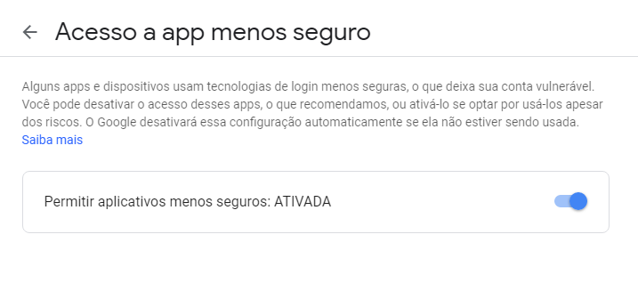
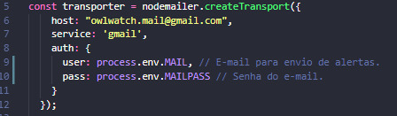
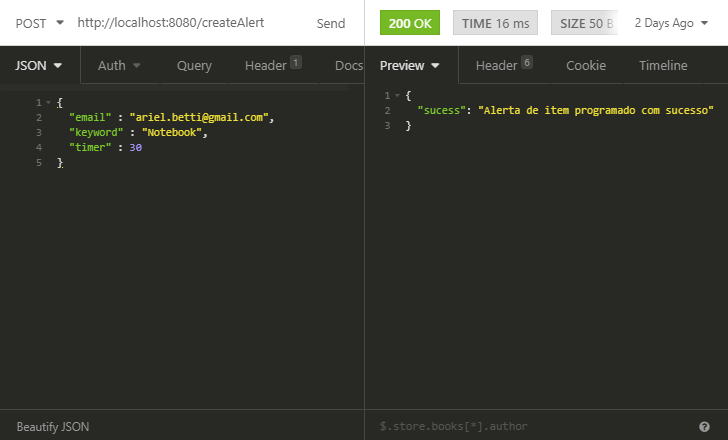
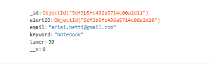
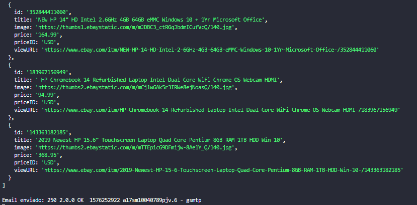
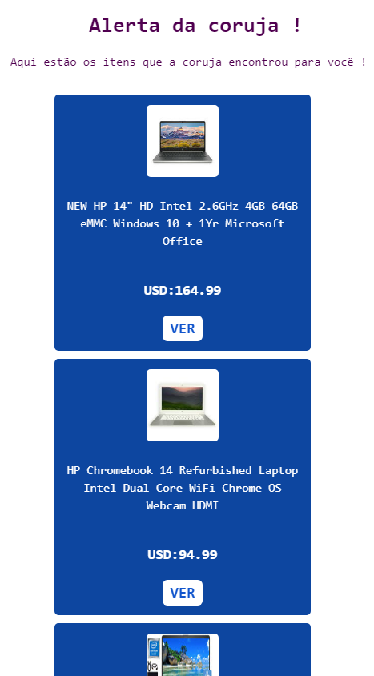

# OwlWatch

> API desenvolvida em Nodejs para envios automáticos de emails programados.

## Instalação

```sh
git clone https://github.com/ArielBetti/OwlWatch
```
Dentro do projeto de um yarn install ou npm install

```sh
yarn install
```

# Como iniciar o projeto

### Desenvolvimento

```sh
yarn dev
```

# Como utilizar essa API
Siga o passo a passo para rodar o projeto localmente.

## Configurando email de alertas.
Para que o **Gmail** funcione com esse sistema primeiro devemos habilitar a opção de <a href="https://myaccount.google.com/lesssecureapps?pli=1">Acesso a apps</a>
<br>
<br>


## Configuração de projeto.
Configure o e-mail responsavél por enviar os alertas.
<br>
<br>


#### Requisições
Essa API REST utiliza uma rota **POST** faça uma requisição para **http://localhost:8080/createAlert** 
você pode fazer isso com o software que preferir, nesse exemplo estarei utiizando o **Insomnia**

#### Cadastrando um alerta
Utilize a rota **http://localhost:8080/createAlert** para enviar uma requisição "**POST**", você deve enviar "**email**" seu email ativo, "**keyword**"
o item que você deseja receber alertas e "**timer**" que é o ciclo de minutos que você vai receber os alertas, podendo ser **2**, **10** ou **30**.
<br>
<br>


### Alerta salvo no banco
Após enviar a requisição o alerta será criado no banco com a seguinte estrutura.
<br>
<br>


#### Output
No exemplo definimos "**timer**" com o valor de **30** minutos, ou seja a cada 30 minutos será disparado um email com **3** itens relacionados
a **keyword** definida, o output no terminal será assim.
<br>
<br>
<br>

#### E-mail recebido
Aqui está o seu email, a coruja encontrou os seus itens !
<br>
<br>


### Obrigado por utilizar os serviços da coruja !

## Sobre

Criador: **Ariel Betti**<br>
Email: **ariel.betti@gmail.com**<br>

Distribuído sob a licença MIT. Veja `LICENSE` para mais informações.

## Como contribuir

1. Faça o _fork_ do projeto.
2. Crie uma _branch_ para sua modificação (`git checkout -b feature/fooBar`)
3. Faça o _commit_ (`git commit -am 'Add some fooBar'`)
4. _Push_ (`git push origin feature/fooBar`)
5. Crie um novo _Pull Request_
